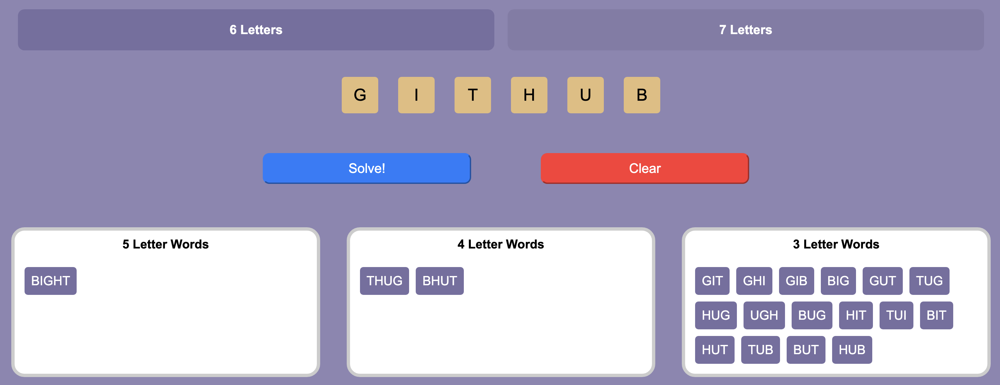

# [Anagram-Solver ↗︎](https://rsura.github.io/Anagram-Solver/)

Anagram Solver is a simple javascript program that takes a word as input and returns all possible anagrams using any combination of letters.

This program is written in JavaScript and can be run in the browser console.

It can be used for anything, but the primary use case is for the game Anagrams in GamePigeon. See the example usage below.

If you decide to use this program for Anagrams in GamePigeon, you can use the program to find all possible anagrams of the given word. The larger the word found, the higher the score you will get. 

There are two game modes 6-letter and 7-letter words. The program can be used for both modes based on the menu option chosen above. With the 7-letter game mode (which is a paid game mode), there is a higher chance of finding a larger word.